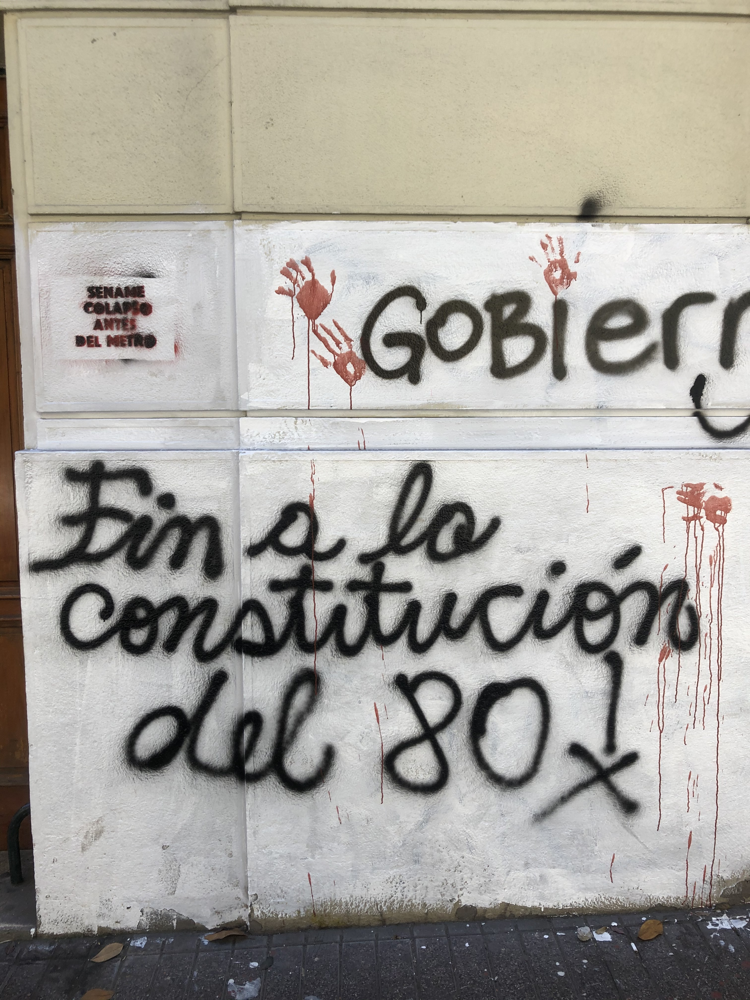
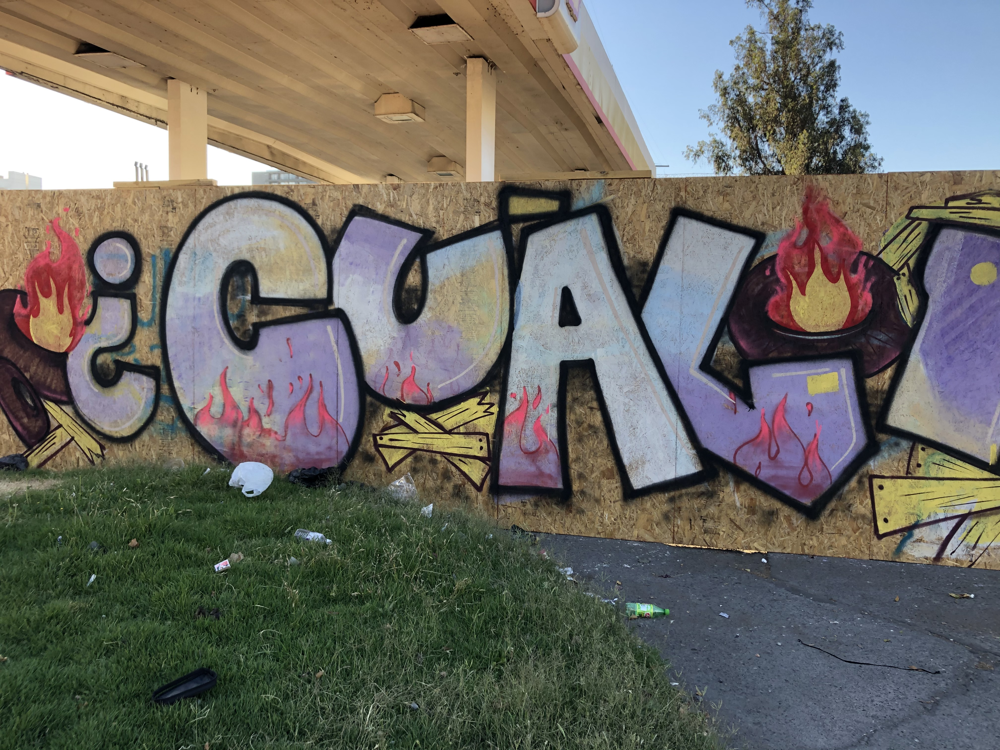
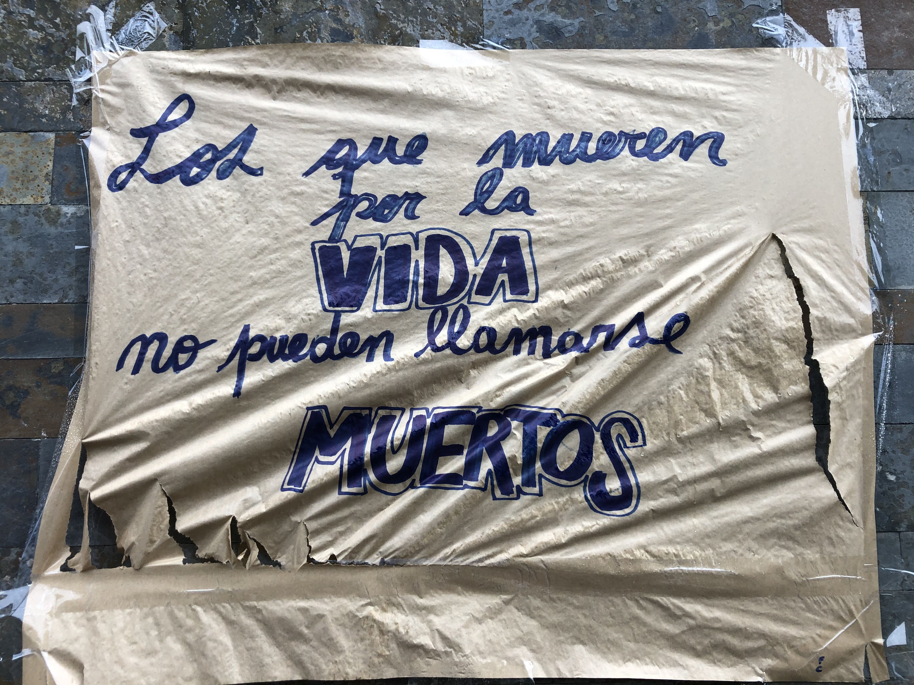

#	El camino hacia una nueva constitución.

Tras un periodo extenso de conmoción social que sacudió las estructuras políticas y la cotidianeidad de la administración del presidente Piñera, Chile buscó una salida que acomodará la magnitud y la profundidad del descontento del pueblo. La alternativa previsible se perfiló por un cambio que de alguna manera contemplara la raíz, quizás, simbólica del descontento que se trazaba hacia los pilares del modelo constitucional cimentados por la carta magna de 1980.

{width=100%}

La Constitución Política de la República de Chile de 1980 es el texto constitucional chileno actualmente vigente que se encuentra en proceso de debate tras el movimiento social. La carta magna actual fue aprobada el 8 de agosto de 1980 y redactada por la  Comisión Ortúzar, Consejo de Estado y Junta Militar de Gobierno. Así mismo, fue promulgada el 21 de octubre de 1980, siendo ratificada el 11 de septiembre del mismo año mediante un plebiscito, la misma figura consultiva que se empleó por el Gobierno de Gabriel Boric en el actual proceso en curso sobre al proyecto constitucional resultado del reclamo social. 

La siguiente imagen muestra una pancarta sobre la universidad de Chile en el corazón de Santiago.

{width=100%}

La necesidad de paz, tras el estallido social, se encausó lentamente por la vía del dialogó, así voces de diversos sectores comenzaron a sumarse en favor de instrumentos que marcaron el camino hacia nuevos senderos, en este proceso la realización de cabildos autónomos fue uno de los primeros signos de integración y un mecanismo para hacer un balance para retornar a la normalidad.  

{width=100%}

{width=100%}

En paralelo a las manifestaciones que tuvieron una menor frecuencia a medida que las semanas avanzaban, un llamado para llevar a cabo una asamblea Constituyente cobró fuerza. Esta salida se perfiló como una vía para la organización de los cambios planteados por la clase política ante la presión popular. 

{width=100%}

La apertura del proceso constituyente en Chile se inició el 15 de noviembre de 2019, con el Acuerdo por la Paz y la Nueva Constitución y el 25 de octubre de 2020 a través de un plebiscito, se decidió, iniciar el proceso para redactar una nueva Constitución. [@guerreroCENTROESTUDIOSPOLITICOS2021].

Sin embargo, un nuevo plebiscito constitucional, conocido como “plebiscito de salida” esta vez en 2022, ya instalado el gobierno del presidente Gabriel Boric, resultó en la no aprobación del  nuevo proyecto constitucional. 

El objetivo del proceso de 2022 fue determinar si la ciudadanía estaba de acuerdo con la propuesta de Constitución Política de la República redactada por la Convención Constitucional. Al respecto, la pregunta concreta de la boleta era ¿Aprueba usted el texto de la nueva constitución propuesto por la convención constitucional? 

{width=100%}

Aparentemente, la ciudadanía no deseaba la nueva constitución propuesta, ya que el resultado anunciado por el Servicio electoral del Chile fué que solo el 38.11% de los sufragios se dieron por la opción de apruebo, lo que dejo a la opción rechazo con una mayoría indiscutible con un 68.99% de los votos [@servicioelectoraldechilePlebiscito20222022], un resultado contrario a las demandas del propio movimiento social original que precisamente reclamaron una nueva constitución. 

El evento del domingo l4 de septiembre de 2022, pasará a la historia como un suceso controvertido y paradójico, que los ojos atónitos de los de chilenos que participaron en las marchas y los 4,859,103 que votaron a favor de la nueva constitución, seguramente recordarán.

{width=100%}

{width=100%}

Ante este resultado, el gobierno del presidente Gabriel Boric, apareció para aclarar que el resultado del plebiscito no significa el fin del proceso constituyente, acción estratégica que dosificó, mediante un tono conciliador la respuesta oficial ante la furia del pueblo y demostró una cuidadosa planificación que ofrece una esperanza mediante un texto final sometido en otro plebicito programado para el 17 de dicimebre de 2023. 

Hoy el sol resplandece nuevamente sobre la nación sudamericana, ya los días de marchas y enfrentamientos se quedan en la distancia y mientras un nuevo gobierno con su juventud toma decisiones para la conducción del país, es la historia la que se encargará de develar el juicio imparcial de un periodo crucial para la nación conocido como el despertar de Chile, en donde los ciudadanos tendrán que mirarse en el espejo y responder por el legado de esta etapa a generaciones venideras en este gran país al sur del mundo. 

