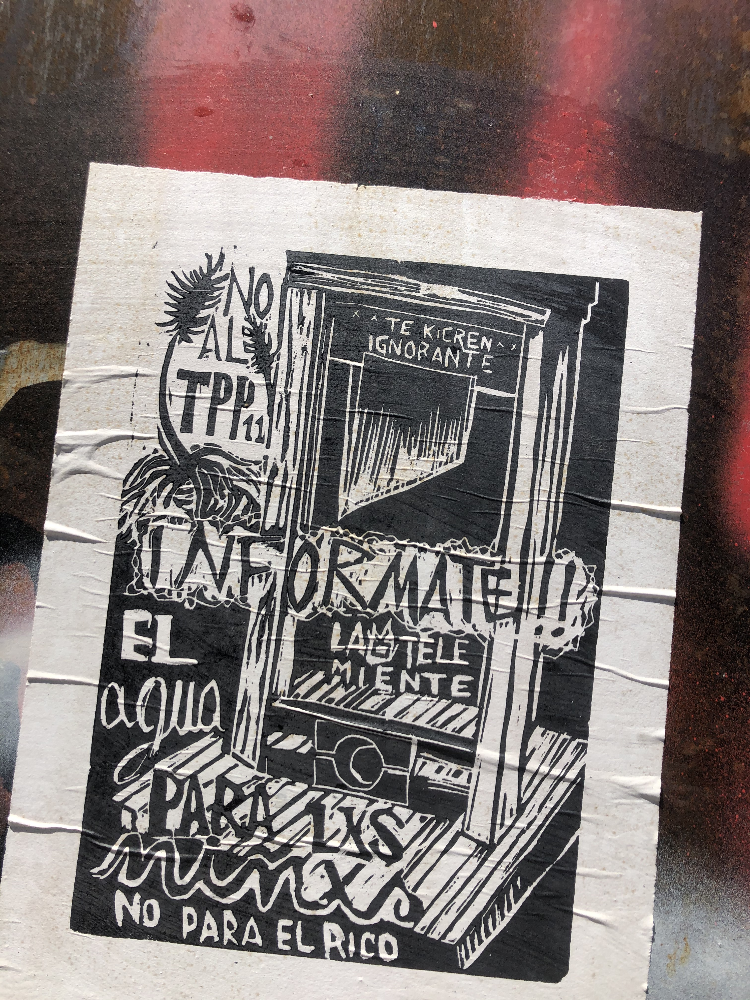
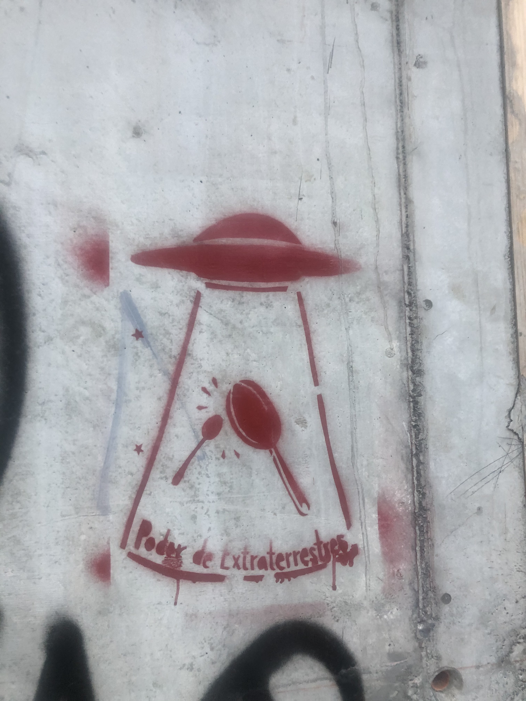
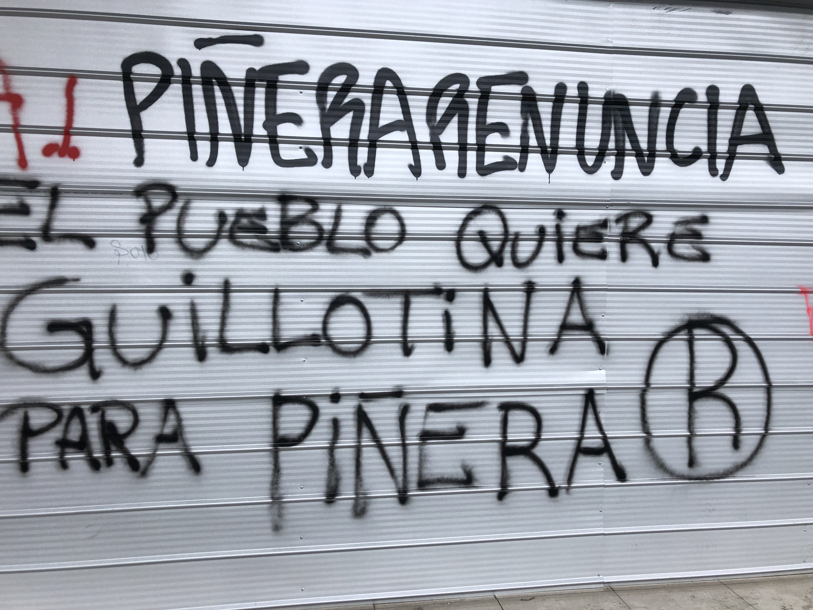
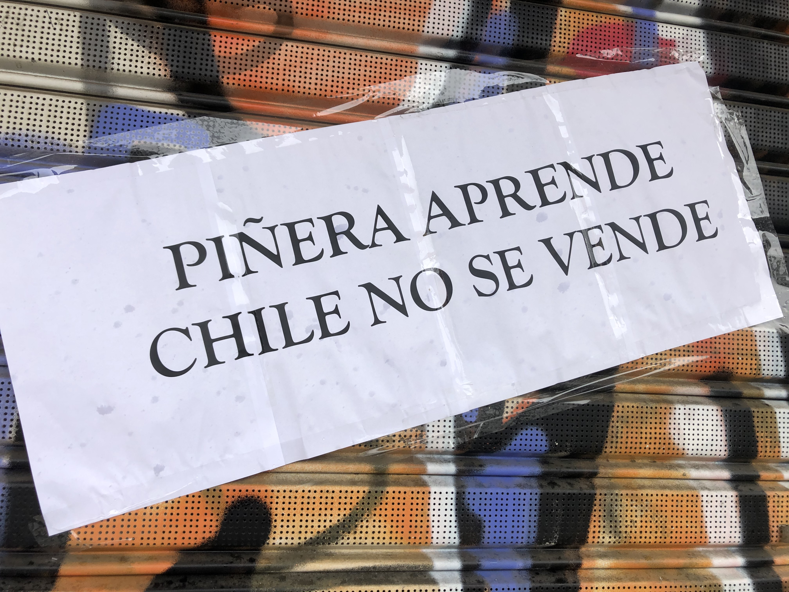
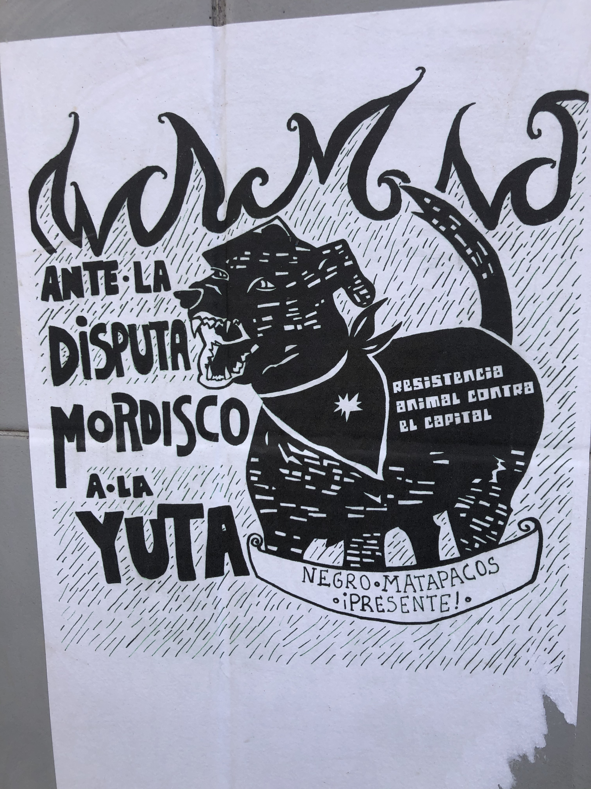
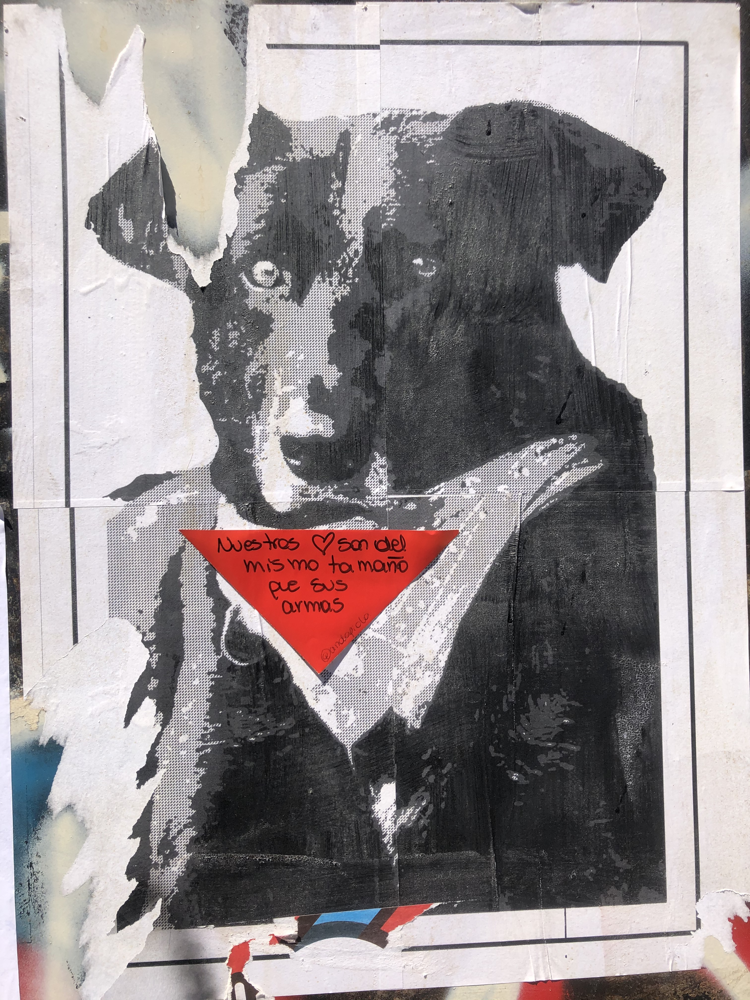

# Cansados de opresión: Los Pacos, la Yuta y los Melicos en el ideario público.

La historia reciente de Chile, sobre todo desde la segunda mitad del siglo pasado, ha sido testigo de notables tensiones sociales que han llevado a realizar ajustes, políticos y económicos, en ocasiones drásticos y de consecuencias de largo plazo en la memoria colectiva. 

Ciertamente el golpe militar del 11 de septiembre de 1973 y la dictadura resultante, que derrocó al presidente socialista Salvador Allende, dejaron una herida en la conciencia y el ideario cultural que vincula las instituciones de fuerza policial con la represión propia de un periodo de gobierno militar. Desde la perspectiva de investigadores como [@cortesVulneracionDerechosHumanos2021], el impacto en salud mental de la población que vivió en dictadura en los años setentas,  es incierto. 

El último discurso que el presidente Allende ofreciera al pueblo chileno, antes de perder la vida en medio del ataque de las fuerzas militares golpistas al palacio de la Moneda, sede oficial de gobierno de aquel país donde se refugió el presidente, perecieran predecir la furia con la que casi medio siglo después, el pueblo chileno reclamaría justicia. A continuación, un breve extracto del referido discurso transmitido en la víspera de su derrocamiento:

>”Yo no voy a renunciar. Colocado en un tránsito histórico, pagaré con mi vida la lealtad del pueblo. Y les digo que tengo la certeza de que la semilla que entregáramos a la conciencia digna de miles y miles de chilenos no podrá ser segada definitivamente. Tienen la fuerza, podrán avasallarnos, pero no se detienen los procesos sociales ni con el crimen ni con la fuerza.” Discurso a través de Radio Magallanes 11 de septiembre de 1973.[@allende.salvadorUltimoDiscursoSalvador1973]

Palabras proféticas las pronunciadas por el mandatario minutos antes de su muerte, la genuina razón de un médico  con profunda vocación patriótica^[Es interesante el perfil académico del presidente Allende, quien siendo médico de formación llegó al poder con una evidente inmensa vocación política. Actores sociales con formación académica en disciplinas como medicina en posiciones como la presidencia de un país, no son comunes, sin embargo, en Sudamérica encontramos paralelismos de gran envergadura como el Dr. René Favaloro en Argentina, un connotado cardiólogo con un profundo sentido patriótico, cuyo “dolor” por su patria, lo llevo a expresar a través del análisis histórico una dura crítica a las políticas gubernamentales de la Argentina durante los procesos de reorganización nacional de la dictadura.], que, en medio de la tormenta política y los intereses hegemónicos de su tiempo, asumió la más alta factura dejando impresa en la historia una lucha que como es evidente con los sucesos de octubre de 2019, sigue vigente y reclama justicia, a partir de la semilla de la dignidad popular.

Hoy, como ayer, un gran segmento de la población marginado y testigo de una creciente desigualdad expresa su inconformidad. La respuesta inmediata por parte del estado es aplicando su fuerza usando los diferentes cuerpos policiales disponibles. La militarización del conflicto no se hace esperar y la represión se torna violenta. Este rasgo, se vuelve un punto central de la protesta que parece rescatar la sed de justicia acumulada por la población vertida sobre sus propias fuerzas del orden que son referidas despectivamente como: pacos, milicos y la yuta. 

Mensajes como el siguiente, comienzan a observarse por las calles de diversas regiones del país, usando el escudo, emblema de las fuerzas de carabineros en clara inconformidad.

{width=100%}

Es clara la animadversión de algunos segmentos de la ciudadanía sobre los cuerpos policiales y las expresiones de repudio cubren una variada gama como lo expresa el cartel siguiente observado en los kioskos de las avenidas principales de la capital Santiago.

{width=100%}

Los grupos más radicales que participaron en los momentos más álgidos de los enfrentamientos entre manifestantes y los carabineros son representados por carteles a lo largo y ancho del territorio nacional, tal como se observa con la siguiente representación.

{width=100%}

A medida que los casos sobre lesionados comenzaron a difundirse tanto por los medios como por redes sociales, la expresión creativa de los integrantes del movimiento se intensificó y se crearon materiales y campañas como la denominada “La tele miente” o “apaga la tele”. En una clara señal de la conciencia sobre el papel, cada vez más importante que juegan los medios de comunicación en sustento de un sistema y los intereses del modelo establecido.

{width=100%}

La batalla en el terreno de las ideas, fue un rasgo que imprimió un carácter especial al movimiento conocido como el despertar de chile. A diferencia de 1973, hoy la población tiene un arsenal de medios de comunicación que entre otras cosas permite conocer en tiempo real el desenvolvimiento de los hechos, mecanismos como los mensajes emitidos mediante plataformas como Whatsapp o Twitter definitivamente moldearon el grado de organización y masificaron el impacto de convocatoria.  En medio del basto volumen de información, se observa a una sociedad más critica y preocpada por los contenidos, su veracidad y los peligros de la desinformación.

{width=100%}

Especial blanco de consideración en los mensajes de parte de manifestantes se dirigió a los medios de comunicación tradicionales como la televisión y la programación que ofrece noticias de manera cotidiana a los ciudadanos del país.

{width=100%}

Aunado al material distribuido en forma impresa con relación al papel de medios de comunicación masiva, las redes sociales jugaron un papel importante para darle cohesión a las demandas de los múltiples sectores que convergieron en el movimiento. 
La siguiente relación de hashtags es una muestra que representa la diversidad de intereses que los ciudadanos de Chile manifestaron durante el movimiento, cabe decir que una nueva generación de hombres y mujeres chilenos familiarizados con el uso de redes sociales y mecanismos digitales de comunicación significó un elemento que permitió dar voz y recoger el sentimiento social que impulsó un movimiento de tal magnitud. 

[#NoHemosConseguidoNada](https://twitter.com/genarocuadros/status/1188255991336439809), #EstorecienComienza, PeñeraViolaDDHH, #MarchaMasGrande, #RenunciaPiñeraDictador, #NosQuierenRobarHastaLaMarcha, #EstoPasaEnChile, #AbajoElGobierno, #ChileDesperto, #ChileQuiereCambios, #Toquedequeda, #DestitucionDePiñera, [#PiñeraNoTePerdono](https://twitter.com/hashtag/pi%C3%B1eranoteperdono?src=hashtag_click), #ChileViolaLosDerechosHumanos, #TPP11, #NuevoPacto, #ChileDespierta, #estaweaesinnecesaria, #27OCT, #MacriPiñeraLaMismaBilletera, #26OCT, #EstoEsChile, #MontajesSML. #PiñeraRenuncia, #CambioDeGabinete, #EstoNoPrendio, #LaMarchadelMillon, #NuncaMasNeoliberalismo, #ChileDesperto, [#LaMarchaMasGrandeDeChile](https://twitter.com/search?q=LaMarchaMasGrandeDeChile.&src=typed_query&f=top), #24OCT, #40Horas, #Oportunistas, #NoMasPrivilegios, #ChileNoSeRinde, #LosMelicosNoSonTusAmigos, #Helicoptero, #NoMasTag, #HoySeSale, [#AsambleaConstituyenteAhora](https://twitter.com/search?q=AsambleaConstituyenteAhora&src=typed_query&f=top), #NoHemosLogradoNada, [#Constitución2020](https://www.facebook.com/100063772742878/videos/2849630495303030?__so__=permalink), #ChileViolaDerechosHumanos, [#ChadwickAsesino](https://mobile.twitter.com/hashtag/ChadwickAsesino?src=hashtag_click), #LaTVMiente. #GobiernoAbdica, #QueRenuncienTodos, [#RevoluciónAlienígena](https://twitter.com/search?q=Revoluci%C3%B3nAlien%C3%ADgena&src=typed_query&f=top), #TusManosTienenSangre, [#CambiodeGabinete](https://twitter.com/hashtag/CambiodeGabinete?src=hashtag_click), #noMasTorturas, #[ChileQuiereCambios](https://twitter.com/search?q=ChileQuiereCambios.&src=typed_query&f=top). [#QueSeVayanLosMilicos](https://twitter.com/search?q=QueSeVayanLosMilicos&src=typed_query&f=top), #MilicosALosCuarteles, #primaveraDeChile.

La notable carga política que se observa en los mensajes encuentra su epicentro en el concepto de cambio. 
Ante el desbordamiento popular y citando al historiador Sergio Grez Toso, se tuvo “un torpe y prepotente manejo del gobierno de Piñera, imbuido de la tradicional y despectiva actitud patronal en el trato a las clases populares”, [@grezEstaVezPoder2019]. 

Así vemos que las redes sociales capturaron también por esta vía el sentimiento de la gente con tuis como: #TusManosTienenSangre, #AbajoElGobierno, #QueRenuncienTodos, #GobiernoAbdica y #HoySale, #PiñeraNoTePerdono y [#DestitucionDePiñera](https://www.facebook.com/hashtag/destituciondepi%C3%B1era/?source=feed_text&epa=HASHTAG).[#RevoluciónAlienigena.](https://twitter.com/londrinaa_/status/1188572659535220737)

{width=100%}

Ante la crisis nacional, el 26 de octubre el presidente Piñera hace la siguiente declaración. 
“He pedido a todos los ministros poner sus cargos a disposición” [@gobiernodechilePresidentePinera2019]. Declaración realizada justo después de ocurrida la manifestación denominada “la marcha del millón” que aconteció el día 25 de octubre de 2019, misma que algunas estimaciones han calificado como la más grande de la historia reciente en Chile.

En especial el enojo popular se dirigió a personajes políticos como Andrés Chadwick, primo hermano del presidente Sebastián Piñera y ministro del interior y seguridad pública nombrado en marzo de 2018. La inconformidad se observa también en la radiografía de tuis del movimiento con hashtags como [@#ChadwickAsesino](https://mobile.twitter.com/Mr_stevecorp/status/1186424012810915840).

{width=100%}

La trayectoria política del ministro Andrés Chadwick nos da una clara idea de los principios y la profunda carga ideológica que distinguieron el segundo periodo de gobierno del presidente Piñera. La carrera política de Andrés Chadwick se remonta al periodo de la dictadura de Pinochet, donde siendo joven ya mostraba su deseo de involucrarse con la elite gubernamental, así por ejemplo, fue uno de los 77 jóvenes que participó en El Acto de Chacarillas, [@gonzalez-cangasMasOrdenaditosFascismo2020] (en el cerro del mismo nombre en la ciudad de Santiago) un acontecimiento histórico donde 77 jóvenes seleccionados de todo el país^[Este acto revistió un simbolismo deliberado por parte del gobierno de Pinochet. Los 77 jóvenes son un recuerdo a los 77 militares que perdieron la vida en 1881 en la icónica batalla de La Concepción, que formó parte de la guerra del pacífico, ganada por Chile y en la que Perú perdió regiones importantes como Antofagasta y Bolivia perdió su litoral.], se reunieron para acompañar al presidente Pinochet en un discurso emblemático donde delineó el plan de su gobierno militar [@alvarado-leytonActoChacarillas19772018].

Los jóvenes portaban una antorcha y marcharon por los senderos del cerro Chacarillas hacia la cima donde se encontraba el templete desde donde el dictador emitiría su discurso, lo que añadió al simbolismo del evento, con un joven Andrés Chadwick representante en jefe del Movimiento Gremial de la Universidad Católica de Chile [@montealegreCenizasMemoriaTestimonio2014].  

Ya como figura activa dentro del gabinete de Augusto Pinochet [@brodskyVivimosJuntosCon2013], Chadwick participó como miembro de la comisión legislativa de la junta militar del gobierno.

Posteriormente, durante la primera administración del presidente Sebastián Piñera, Chadwick ocupó el cargo de ministro del Interior y Seguridad Pública, cargo que repitió en la segunda administración y que terminó con su remoción el 28 de octubre de 2019 y un juicio asociado a su responsabilidad durante las acciones de las fuerzas públicas en contra de los manifestantes [@santandercepedaChilePactoSocial2020] que derivó en una sentencia de inhabilitación por 5 años que le limita a ejercer cargos públicos, hasta 2024 [@bibliotecadelcongresonacionaldechileResenaBiografica2023].

La respuesta popular ante las declaraciones y el accionar de las fuerzas policiales fue una decidida movilización que se tornó en rebeldía contra la represión popular como se observa en la siguiente representación en donde se hace referencia a la “yuta” un vocablo de connotación despectiva que se dirige a los militares y fuerzas encargadas de las tareas policiales en Chile.

{width=100%}

Los sitios de potresta alrededor del país, se concentraron en las principales plazas públicas, monumentos de generales o caudillos asociados a la colonización del terrirotio. Por este motivo gran parte de los mensajes y las expresiónes de protesta se dieron en fachadas de edificios públicos, comercios y establecimientos que decidieron, ante la magnitud que adquirió el movimiento, proteger sus establecimeintos, como se observa con el caso anterior donde hojas de triplay, sierven al mismo tiempo de protección y de lienzo para la creatividad popular en medio de las protestas.  

{width=100%}

Paulatinamente el centro de atención se dirigió hacia el jefe del ejecutivo, el mandatario Sebastían Piñera, quien, mediante un discurso, aparentemente, desfasado de la velocidad con la que avanzó la información, fué atendiendo la emergencia social. 

Sebastián Piñera un mandatario que, teniendo una amplia y fructífera trayectoria en el sector financiero, había incursionado en la política con un elevado índice de aceptación, se ubicó a sí mismo en una trayectoria adversa al mostrar su incapacidad por desprenderse de ese lenguaje, definitivamente carente de empatía para con su pueblo. 

La respuesta por parte de los manifestantes fue enfática y permitió retratar las grietas de un sistema económico que al parecer encontraba sus límites. 

{width=100%}

La percepción popular sobre los vínculos del mandatario con una visión a favor de las prácticas extractivas, propias de un entorno económico mercantilista altamente globalizado,  resultó en diversos mensajes distribuidos por toda la geografía chilena. 

Especialemente en el sur del país en el Wallmapu, como el pueblo mapuche denomina sus territorios ancenstrales, considerados sagrados, donde la actividad extractiva en sectores como el forestal es intensa, se han documentado a lo largo de la historia, diversas formas de violencia incluidas la física, la ecológica y la simbólica  tal como lo muestran los trabajos de [@gonzalez20196] o [@montoyaNuevasEstrategiasMovimientos2014]. 

En esta región, la actividad de corporaciones como la española ENDESA que opera la central hidroeléctrica Ralco, cuya actividad ha sido objeto de controversia desde su planificación hasta su operación, ha sido estudiada por diversos académicos, en especial, el  trabajo de investigación: "El conflicto Mapuche-Pehuenche y la construcción de la central Ralco: análisis de la disputa y el uso de la mediación" de Eduardo Silva [@silva2004conflicto], destaca la importancia de la mediación como herramienta para la resolución de conflictos.

Colbún (con participación importante de la empresa a japonesa [Mitsui](https://www.mitsui.com/cl/es/business/index.html)), que opera la Central Hidroeléctrica Los Lagos: ubicada en la comuna de Curacautín, en la Región de La Araucanía, es una central que tiene una capacidad instalada de 490 MW y se encuentra en operación desde el año 2008. La central utiliza las aguas del río Truful-Truful para generar energía eléctrica.[@montoyaNuevasEstrategiasMovimientos2014]. 

Arauco (con importantes inversiones de la empresa sueca Stora Enso), opera varias plantaciones forestales y fábricas de celulosa y papel en la región o la empresa [CMPC](https://ir.cmpc.com/Spanish/descripcion-general/la-compania/default.aspx) que tiene participación  de capital de la empresa sueca SCA también opera plantaciones forestales y tiene actividad de procesamiento de productos derivados. 

De hecho, los polémicos proyectos de esta empresa incluyen plantaciones monocultivo de Pino y Eucalipto en territorio Mapuche lo que representa una fuente activa de conflicto con implicaciones adversas debido a los impactos ambientales, sociales y culturales de estas plantaciones.

Desde el punto de vista amabiental por ejemplo, el reemplazo de especies nativas  ha alterado la biodiversidad y los ciclos narurales  en particular, las plantaciones monocultivo de pino y eucalipto en la región sur de Chile tienen un impacto adverso significativo en el ciclo hídrico[@navarroDesarrolloSostenibleEcoetnocidio2005] debido a su alta demanda de agua y su capacidad para reducir la infiltración de agua en el suelo. Adiconalmente afectan el entono al desplazar a especies de árboles nativos como el: Lenga, Coigüe o el Raulí.  

Los casos anteriores son un ejemplos de actividad vinculada a la extracción y procesamiento de recursos naturales que han generado controversía,  entre otros elementos por sus impactos en el ecosistema y las comunidades locales, en una región del país que cuenta con una dotación de recursos naturales privilegiada.

Así mismo, estos procesos, que se avivaron en el marco del reclamo general en el país ocurrido en octubre de 2019, denotan la presencia activa de la comunidad indígena  y una creciente capacidad de organización. 
Las demandas del pueblo mapuche se detallan por los documentos de asesoría técnica parlamentaria [@meza-lopehandiamatiasPrincipalesDemandasMapuche2019] en un compendio realizado previo a los hechos sucitados durante el despertar de Chile e incluyen derechos políticos, Económicos, sociales y culturales. 

{width=100%}

Mientras tanto en las calles de la capital se documentaba que las propiedades balísticas de las armas usadas en la respuesta militar a los manifestantes causaron de manera grave lesiones en la población [@reynhoutPropiedadesBalisticasPerdigones2020] y una vez difundidos los materiales referentes a casos como los de Gustavo Gatíca y las demandas por violaciones a los derechos humanos, la tensión sobre los miembros del gabinete se recrudeció. 

La siguiente imagen es una representación hecha en una de las aceras de la avenida San Antonio, justo en las inmediaciones de la parroquia San Francisco de Alameda en la ciudad de Santiago, mostrando la indignación del pueblo ante las mutilaciones cometidas bajo el mandato de Sebastián Piñera.

{width=100%}

La tensión y repudio sobre la administración de Sebastián Piñera  pronto fue un denominador común a lo largo del territorio. El siguiente mensaje creado sobre triplay protector en las calles de Santiago, provee un enfático símbolo de lo que segmentos de la población consideraban una necesidad para emprender un dialogo que ya perfilaba un concenso, dirigido a la creación de una convención constituyente. 

Eran estas las señales de una articulación de las diversas voces que convergerían en un llamado no sólo por la destitución de los miembros del gabinete del presidente y al propio mandatario pero, se dirigían ya con un objetivo más claro, a la reformulación de la carta magna vigente producto del régimen dictatorial de Pinochet. 

{width=100%}

La gama de actores sociales objeto de reclamo, incluyó a la iglesia, en particular en Chile un segmento mayoritario de la población se identifica con la religión católica y numerosas instituciones que articulan el andamiaje institucional han tenido históricamente influencia del clero. Una de las instituciones académicas más prestigiadas del país: la universidad católica de Chile, ha sido un importante semillero de teóricos que han definido el rumbo de Chile en la historia contemporánea, como el caso del abogado Jaime Guzmán a quien se le atribuye el sustento teórico en la redacción de la constitución de 1980 y fundador de Movimiento Gremial de la Universidad Católica de Chile, organismo que a la postre dirigiera el entonces joven Andrés Chadwick, hoy inhabilitado para ejercer cargos públicos. 

{width=100%}

Vemos de forma recurrente el acronimo ACAB, correspondiente a la frase inglesa “**A**ll **C**ops **A**re **B**astards”, que historicamente se ha asociado con las protestas sociales y crítica en contra de la represión popular [@canellasEsteticaMalPerformatividad2021]. Así mismo, se observa una actitud recriminante expresada mediante declaraciones sobre el silencio de la iglesia. Sin embargo, en medio del legítimo clamor social en demandas concretas, comenzamos a percibir también, cómo elementos radicales del discurso de anarquía, comienzan a estar presentes, es precisamente este rasgo lo que incide en los episodios de violencia registrados entre los eventos de protesta sucitados durante el movimiento. 

El siguiente mensaje denota el impacto emocional que se vivió a partir de los lamentables sucesos en los que jovenes manifestantes fueron blanco de disparos que les causó la pérdida de globo ocular y otras lesiones graves. 

{width=100%}

El ideario colectivo, a través de la historia de los movimientos sociales en Chile ha creado símbolos e íconos que en ocasiones de manera espontánea han surgido y se han legitimado por su afinidad con grupos demográficos concretos. 

Es el caso del “negro mata pakos”, un perro que portaba un pañuelo rojo que se volvió popular durante las marchas de manifestación estudiantil de 2011. Famoso por ladrarle a los efectivos armados de la fuerza policial y por su actitud agresiva hacia los uniformados en los episodios de protesta.

La popularidad de este canino creció a tal grado que los manifestantes han adoptado su imagen para simbolizar el repudio a militares y carabineros. La figura del "negro mata pacos", resurgió en octubre de 2019 y diversos materiales para difusión se elaboraron y fueron adoptados como rasgo de identidad entre los jóvenes manifestantes. El siguiente cartel muestra este fenómeno.

{width=100%}

El "negro", como era conocido entre los círculos universitarios, se convirtió en un símbolo social genuino que ha trasciendido por su espontaneidad. Este ícono de resistencia social logra capturar el sentimiento de manifestantes en una  posición defensiva y a la vez transmite un mensaje de rechazo en contra de las expresiones de maltrato y abuso, frecuentemente presentes en actos públicos de protesta. 

La creatividad que desplegaron los ciudadanos durante las protestas de **El despertar**, recoje una diversidad de expresiones que integra a grupos demográficos de sucesivas generaciones. Y muestra un denominador común con símbolos que han aparecido en otros movimientos de protesta de gran importancia a escala mundial, como el caso del "Loukanikos" un ícono canino presente en las notables protestas anti austeridad que tuvieron lugar en Grecia a inicios de la segunda década de este siglo en el continente Europeo. 

Son precisamente este conjunto de elementos los que dan cuenta de la extensión cultural de la protesta y los mecanismos diversificados de difusión de los mensajes que en el fondo tienen un carácter profundamente humano. 

{width=100%}

En el ideario popular los pacos, un vocablo referido a los militares generalmente, son asociados con represión. El siguiente mensaje con el perfil de icónico de Pinochet famoso por el atuendo con lentes obscuros, es presentado con particular animadversión.

{width=100%}

Un fenómeno que repercutió en demandas por abuso y violación a los derechos humanos, fue el referente a las condiciones de detención de algunos manifestantes, en particular se registraron casos de mujeres jóvenes como el presuntamente ocurrido a una adolescente de 15 años en la 25 comisaria de Maipú [@eldinamoINDHSeQuerella2019] y que fue objeto de difusión mediante carteles en diversos puntos de la ciudad de Santiago capital. 

{width=100%}

Con variaciones de diversa índole, el blanco de reclamo que representaron las fuerzas policiales o pacos, fue un denominador común que se distribuyó en las diferentes marchas del movimiento. La siguiente representación gráfica, da cuenta de este fenómeno.

{width=100%}

Ya avanzado, el estallido social, el recuento de los impactos de los choques y turbas de manifestantes con las fuerzas del orden, fue tomando forma y se inició una campaña para dar a conocer a los lesionados y fallecidos: Las organizaciones y gremios compartieron biografías de la población afectada y descripciones de los hechos con la finalidad de hacer visible los incidentes y buscar llevar a juicio a los responsables. Lo cual ocurrió en algunos casos como el de la joven Fabiola Campillai, que fue víctima del lanzamiento de recipiente de gas lacrimógeno directamete a su rosto y por el cual, no solo perdió la vista pero tuvo multiples lesiones irreversibles.

El destino de Fabiola Campillai cambió a partir de los episodios ocurridos en el “El despertar”, tanto por la marca física y sicológica, que este episodio histórico generó, pero también por la puerta que se abrió en su camino profesional, al ser electa para desemepñar un cargo de elección popular en servicio del pueblo chileno.
Fabiola fué electa como senadora independiente por la 7ª circunscripción, Región Metropolitana de Santiago para ocupar un escaño en el partlamento en legislatura 2022-2030 donde tiene la oportnidad de llevar a cabo de forma directa tareas para concretar los ideales que el movimiento social reclamaba.

El siguiente cartel muestra una recopilación de víctimas de los sucesos ocurridos durante el estallido social. 

{width=100%}

