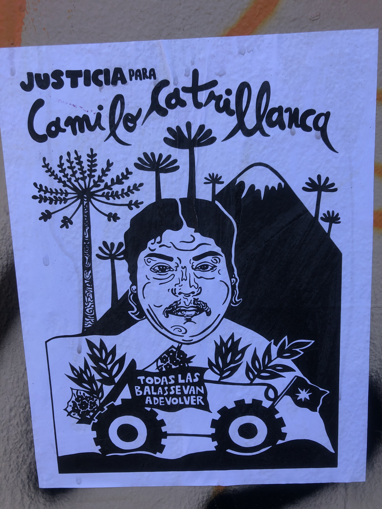

# La herida abierta en el Wallmapu y el pueblo Mapuche.

La conformación demográfica de Chile, presenta en la actualidad una mezcla de perfiles, las diversas etapas de la historia han contribuido a conformar una sociedad multicultural, sin embargo, a diferencia de países como Argentina donde, los pueblos originarios fueron prácticamente exterminados, o México, donde se presente un proceso de mestizaje con una diversidad regional, en Chile, los habitantes ancestrales de esas tierras sudamericanos, los Mapuche (Mapu: Tierra, Che: Gente) han ocupado la parte central y sur del país y no han podido ser exterminados, a pesar de sistemáticos intentos a lo largo de los siglos por los grupos hegemónicos y el poder político.

El pueblo Mapuche originalmente asentado a lo largo de un extenso territorio que se extendía desde el río Choapa en el norte hasta el canal de Chacao en el sur, y desde la cordillera de los Andes en el este hasta el océano Pacífico en el oeste, ha sido paulatinamente orillado a ocupar fragmentos marginales cada vez más reducidos de lo que una vez fue su hogar hacia la parte sur del territorio chileno en los límites que marca el río Biobío, en lo que hoy se conoce como la frontera hacia el sur. 

Han resistido los embates de la avaricia por recursos naturales y la implacable fuerza de los intereses económicos que se ha caracterizado por lo que algunos historiadores a la luz de la evidencia, han denominado, un despojo de sus tierras [@correaHistoriaDespojoOrigen2021] proyectando un conflicto por la defensa de su territorio a través de los siglos. 

Durante su gestión como ministro de guerra, durante las primeras décadas del siglo XIX, Diego Portales, impulsó entre otras acciones controvertidas la creación del Regimiento de Cazadores a Caballo, una fuerza militar especializada en la lucha contra los mapuches, y estableció una serie de fortificaciones y puestos militares en la zona de influencia de los mapuches, lo que marcó un hito en la trayectoria del movimiento social mapuche por la defensa de sus derechos materiales y de su existencia misma [@barrosGuerraArauco2006]. 

La legitimidad del movimiento histórico de defensa por parte del pueblo mapuche, se hace evidente al considerar el papel que han tenido las diversas oleadas de violencia cuyo impacto depredador en los recursos naturales ha generado una herida en la identidad mapuche que alimenta con fervor las demandas de justicia observadas hasta el día de hoy.

Ya desde la incursión española del siglo XVI con el capitán Pedro Valdivia se tenían álgidas tensiones y se suscitaron batallas emblemática como la que protagonizo el jefe Mapuche Lautaro, el 23 de diciembre de 1533 en la que venció a Valdivia durante el episodio histórico conocido como la batalla de Tucapel donde Lautaro, último gran jefe mapuche, defendió con éxito su territorio de la ocupación invasora del conquistador español, durante la guerra de Arauco [@villalobosVidaFronterizaAraucania1995].

Desde la conformación del país que hoy conocemos como Chile construido sobre el territorio ancestral del pueblo Mapuche, hasta hoy en día se percibe una continua confrontación alimentada por  prácticas que reflejan una evidente asimetría en los balances del poder. Recientemente prevalecen las tensiones y hechos lamentables de violencia son parte del vivir de la región de la Araucanía. 

El asesinato de miembros de la comunidad mapuche como Camilo Catrillanca dan cuenta de la frágil estabilidad y las tensiones que los “wingkas”^[Nombre en indioma Mapudungún que reciben los individuos no Mapuches. Tradicionalmente es un vocablo que hace referencia a los conquistadores españoles y colonos que se establecieron en el territorio Mapuche]  protagonizan en contra de la “gente de la tierra” y son testimonio doloroso de una herida abierta en el Wallmapu. 

Corría, el 34 de abril de 2007, cuando Camilo Catrillanca, un joven mapuche de 24 años, nieto del connotado líder del movimiento Aiihyuke Catrillanca, es interceptado por efectivos presuntamente pertenecientes a cuerpos especiales de carabineros, mientras conducir un tractor por un camino rural cercano a la localidad de callipuyii y es ultimado. 
La pérdida de la vida de este joven detona una sentida manifestación y un clamor social desde lo mas hondo de la Araucanía.

El siguiente cartel, muestra una representación de la imagen del joven que fue emblema del movimiento social de octubre de 2019.

{width=100%}

El idioma del pueblo Mapuche es el Mapudungún y es aún usado entre los miembros de la comunidad mapuche, con mayor fuerza en la región de la Araucanía. Poblaciones como Temuco, la capital provincial o la apacible Villarrica, son reflejo de la ancestral cosmovisión de este pueblo milenario. El siguiente mensaje, escrito en idioma Mapudungún, literalmente indica: “recuperaremos nuestra tierra”.

{width=100%}

El arraigo del pueblo mapuche con los recursos naturales y el apego al territorio son parte de la definición de este importante legado cultural, sin embargo y contrario a la tendencia mundial, en Chile no se tiene un reconocimiento a los pueblos indígenas. 

Esta visión muestra un paradigma contrario a la tendencia mundial en sociedades avanzadas donde cada vez más se mira a los pueblos originarios como fuente de sabiduría y sus valores son apreciados, entre otros elementos, por su relación de respeto con los recursos naturales.  

En una era en los patrones climáticos tiene cambios que hacen cuestionar el paradigma depredador en el que los sistemas económicos actuales avanzan, retomar la sabiduría expresada por el vínculo que los pueblos originarios tienen con los recursos de los que dependen, parece un camino importante. 

La situación que se vive en la Araucanía hoy y que se expresó como un elemento del descontento en el estallido social de octubre de 2019, ciertamente es testimonio de una mentalidad incapaz de aceptar una realidad histórica que es la presencia del pueblo mapuche en el territorio, hoy ocupado por una amalgama multicultural. 

El arraigo del pueblo mapuche con los recursos naturales y el apego al territorio son parte de la definición de este importante legado cultural, sin embargo y contrario a la tendencia mundial, en Chile no se tiene un reconocimiento a los pueblos indígenas. 

Esta visión muestra un paradigma contrario a la tendencia mundial en sociedades avanzadas donde cada vez más se mira a los pueblos originarios como fuente de sabiduría y sus valores son apreciados, entre otros elementos, por su relación de respeto con los recursos naturales.

En una era en los patrones climáticos tiene cambios que hacen cuestionar el paradigma depredador en el que los sistemas económicos actuales avanzan, retomar la sabiduría expresada por el vínculo que los pueblos originarios tienen con los recursos de los que dependen, parece un camino importante. 

La situación que se vive en la Araucanía hoy y que se expresó como un elemento del descontento en el estallido social de octubre de 2019, ciertamente es testimonio de una mentalidad incapaz de aceptar una realidad histórica que es la presencia del pueblo mapuche en el territorio, hoy ocupado por una amalgama multicultural. 

{width=100%}

Tras el correr de los años y a través de los diversos tonos que ha tomado la vida política chilena, que por los conocidos periodos de dictadura militar, concertación para el regreso a la democracia y el actual gobierno que Gabriel Boric encabeza con orientación en teoría de izquierda, el pueblo mapuche ha continuado con firmeza inquebrantable,  en sintonía con la magnitud de su causa, con su lucha y para ello ha logrado organizar diversos organismos con redes que aglutinan la causa, de entre estos destacan:  Coordinación Arauco Malleco. (CAM), un grupo organizado con integrantes de los pueblos originarios principalmente Mapuche que busca el dialogo para la defensa de los derechos de los pueblos ancestrales. 

*Weichan Auka Mapu* (WAM) organización en soporte a la reivindicación de los derechos del pueblo Mapuche.  Resistencia Mapuche Lavkenche. (RML), Con una orientación de mayor confrontación y la Resistencia Mapuche Malleco (RMM).

La formación de estos grupos muestra la intensidad del conflicto actual y la complejidad para el manejo desde una administración gubernamental con una visión parcial del fenómeno que requiere soluciones de fondo cuyo costo político, ningún gobernante contemporáneo ha estado dispuesto a asumir. 

Activistas de la comunidad mapuche que luchan por la defensa de la tierra y la protección de los recursos naturales en la región de la Araucanía actualmente se encuentran en prisión, como es el caso de Alberto Curamil quien en 2019 fue galardonado por la comunidad internacional con el premio ambiental Goldman que se otorga anualmente como recompensa a los esfuerzos en defensa por el medio ambiente. 

El caso del longko^[En lengua Mapudungún, Longko significa cabeza  y se refiere al jefe o cabeza de una comunidad, por lo que es una denomminación de liderazgo en la organización social del pueblo Mapuche] Alberto Curamil refleja la tensión que se vive hoy en la región de la Araucanía y la lucha del pueblo Mapuche que ha persistido a lo largo de los siglos. 

Los esfuerzos públicos por la defensa que realizó el longko Alberto Curamil incluyen, la defensa del flujo natural del agua del río Cautín y la protección del ecosistema vinculado a este cause ante los proyectos de generación hidroléctrica promovidos en la región. 

En conjunto con el longko Curamil, miembros de la comunidad Mapuche como el Werkén^[En Idioma Mapudung, el término Werkén hace referencia a un consejero, es una figura importante dentro de la organización social Mapuche, con estrecha relación con el Longko o líder de la comunidad]  Alvaro Millalen, han sido encarcelados en años recientes como parte de las fricciones persistentes en la región de la Araucanía. 

{width=100%}

Al respecto el reclamo social de octubre 2019, visibilizó hacia el exterior la ya añeja lucha de este pueblo indígena por una causa que pareciera tener un eco cada vez más importante a escala internacional en concordancia con la revalorización global que se tiene de los recursos naturales y el cuidado de recursos estratégicos como el agua.  

{width=100%}

