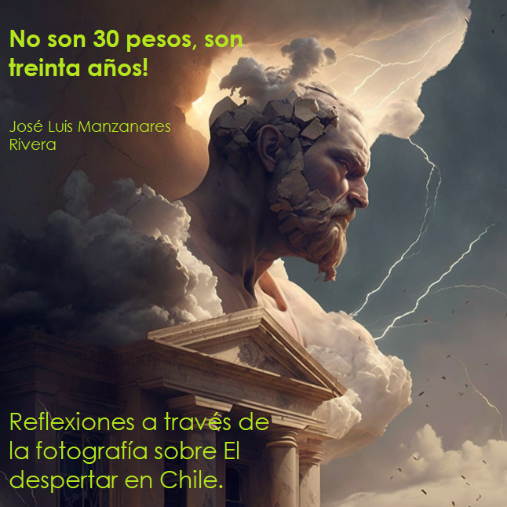

--- 
title: "No son 30 Pesos, son 30 años. Reflexiones a través de la fotografía sobre El despertar en Chile"
author: "José Luis Manzanares Rivera"
date: "`r Sys.Date()`"
site: bookdown::bookdown_site
output: bookdown::bs4_book
always_allow_html: true
documentclass: krantz
bibliography: library.bib
biblio-style: apalike
link-citations: yes
colorlinks: yes
graphics: yes
description: "Es un libro que documenta mediante la expresión grafica, el estallido social en Chile ocurrido en octubre de 2019"
cover-image: "images/cover2.png"
url: https://chile3030.netlify.app
---

# Bienvenidos {-}

Este es el sitio  enlinea del libro *No son 30 Pesos, son 30 años. Reflexiones a través de la fotografía sobre El despertar en Chile.*


<hr>

## Contribuye al proyecto  {-}

Si encuentras el libro útil, puedes contribuir:

- Compartiéndolo con tu equipo y redes. 

- Comentando en medios digitales, por ejemplo, a través del hashtag *#3030* en Twitter.

- Citándolo o enlazándolo.

- Disfruta la lectura comprando un ejemplar en: [BlackDogPublishing](https://insight4health.netlify.app/)
También puedes descargar una copia **gratis** en formato PDF o epub.


<a rel="license" href="http://creativecommons.org/licenses/by-nc-nd/4.0/"></a><br />This work is licensed under a <a rel="license" href="http://creativecommons.org/licenses/by-nc-nd/4.0/">Creative Commons Attribution-NonCommercial-NoDerivatives 4.0 International License</a>.

```{r, echo=FALSE, warning=FALSE, message=FALSE}
library(downloadthis)

download_link(
  link = "https://www.dropbox.com/s/g9jz1nzh3nc2dns/Chile3030.pdf?dl=0",
  button_label = "Download PDF file",
  button_type = "danger",
  has_icon = TRUE,
  icon = "fa fa-save",
  self_contained = FALSE
)

```


```{r, echo=FALSE, warning=FALSE, message=FALSE}
library(downloadthis)

download_link(
  link = "https://www.dropbox.com/s/ercrum32noqpakp/Chile3030.epub?dl=0",
  button_label = "Download epub file",
  button_type = "warning",
  has_icon = TRUE,
  icon = "fa fa-save",
  self_contained = FALSE
)

```


# Prefacio {-}


> *"¿No será tiempo de que la lechuza de Minerva vuele a* 
> *pleno día como mensajera de luz? ¿Con la buena nueva de* 
> *los sujetos sociales de carne y hueso? ¿Del ciudadano real de mediodía?"*    
<div style="text-align: right"> --- Gabriel Salazar </div>


Esta obra fue escrita para capturar las expresiones del pueblo chileno durante el movimiento conocido como El despertar, ocurrido a finales de 2019 en el país sudamericano. 
La imágenes corresponden a los momentos en los que se desarrollaron las protestas en medio de una situación de tensión entre la sociedad civil y los fuerzas policiales desplegadas por el estado Chileno  ante la magnitud de las manifestaciones populares.  

La obra recoge mediante la fotografía, la expresión de la gente, sus demandas y las motivaciones. Gracias a la observación y cuidadoso registro de los hechos, el autor presenta una radiografía de un hecho histórico con implicaciones profundas que definirá el rumbo en años por venir para este país tan importante en Latinoamérica. Los hechos sucedidos en Chile en octubre de 2019 aportan una enseñanza valiosa para los paises de la región. 

El modelo de desarrollo económico  que Chile ha seguido es cuestionado, la polarización y las marcardas brechas en la distribución de los recursos economicos, son objeto de debate, no obstante y  paradójicamente estamos ante la presencia de un pais que ha alcanzado niveles de ingreso destacados en el contexto de los paises latinoamericanos. 
Un país con una riqueza indiscutible en recursos estratégicos para la economía global que se acompaña con una riqueza ancestral expresada por los saberes de su pueblo mapuche. 

Las decisiones del pueblo Chileno hoy en día marcarán el destino de generaciones futuras y el estallido social quedará como un hito que abrió los ojos de una clase política ente una realidad ineludible, pero solo el tiempo con su juicio imparcial permitirá legitimar las soluciones propuestas por una nueva generación de gobernantes  que a diferencia de ayer, hoy gozan del respaldo y el beneficio de haber sido electos bajo un sistema democrático para ejercer la conducción de los destinos de una nación privilegiada.     

# Introducción  {-}

Esta obra recoge el sentimiento de un pueblo a través de la expresión gráfica de sus demandas. El mes de octubre del año 2019 marca en la historia del continente americano y del mundo entero, el momento en que la sociedad en Chile sorprendió al mundo con un ejemplo de organización legítima.

La presente obra integra las muestras de descontento social que se plasmaron a lo largo del país por los integrantes del movimiento social conocido como el despertar de Chile. Las imágenes fueron captadas por el autor en tres ciudades a lo largo del país sudamericano: Santiago, Temuco en la región de la Araucanía y Valdivia en la región de los ríos en el sur de Chile, durante el mes de noviembre de 2019. 


La obra es un testimonio de la voz del pueblo y a la vez es un reconocimiento a la capacidad de una sociedad para plantear su percepción ante los desequilibrios sociales cuya expresión territorial constituye un paradójico ejemplo de un país en donde coexisten las mayores riquezas en recursos estratégicos y las condiciones de precariedad más incomprensibles.


El viernes 18 de octubre del año 2019, el pueblo de Chile inicio el levantamiento de una masiva protesta social, el detonante inmediato, el incremento a la tarifa de boleto para el transporte que brinda la empresa privada con participación estatal: Metro de Santiago, que se presentó con un incremento de 30 pesos, al pasar de 800 a 830. 


El anuncio del incremento tuvo lugar el día 6 de octubre y de inmediato se presentó la reacción ciudadana que inició con evasiones al ingreso de este trasporte público por parte de estudiantes usuarios del servicio, una práctica que se convertiría en un emblema del descontento generalizado y un símbolo de legitimidad. Este fue el inicio del más grande movimiento social en la época contemporánea respaldado por el pueblo a lo largo todos los rincones de la extensa la geografía chilena.


No obstante, tal como la magnitud del movimiento social pronto lo revelaría, ese descontento fue únicamente “la gota que derramó el vaso” en el que distintas reivindicaciones arraigadas frente a 30 años de un modelo de desarrollo encontrarían convergencia. El impacto de la convocatoria ciudadana fue tal que para el viernes 18 de octubre el presidente Sebastián Piñera, declaraba ya estado de emergencia y urgía para instaurar toque de queda total en Santiago.


Pronto, los diversos sectores de la sociedad se sumaron al movimiento mostrando así el descontento de la población sobre los mecanismos actuales de acceso a derechos universales esenciales como la salud o la educación que resultaron ser elementos centrales del movimiento que rápidamente se propagó encontrando eco entre los más diversos estratos de la sociedad chilena que se unieron a este reclamo general a lo largo del todo el país.


Las manifestaciones, que alcanzaron una cobertura territorial general y al mismo tiempo surgieron espontáneamente sobre la geografía chilena, con expresiones culturales tan diversas como el emblemático cacerolazo popular; significaron acorde con el historiador Sergio Grez Toso, un repertorio de lucha descentralizado que mostró la debilidad del poder [@grezEstaVezPoder2019]. 


Desde el mundo y en especial desde los pueblos Latinoamericanos se observó con gran atención el movimiento social popularmente denominado  “El despertar de Chile”, un país que constituye el ejemplo clásico en la región, de la implementación de reformas orientadas a fortalecer los mecanismos de mercado para el funcionamiento de la economía, reformas diseñadas y ejecutadas desde un entorno de dictadura militar en los años ochenta y que permitieron que este país se posicionara como el único país de América Latina catalogado como de muy alto desarrollo Humano y con el mayor nivel de ingreso per cápita de la región [@undpIncomeAveragesToday2019]. 

No obstante, dada la magnitud del movimiento social que vivió Chile y su representación generalizada a lo largo del país, cabe preguntarnos, ¿hasta qué punto esos indicadores de avance y crecimiento son solo una expresión parcial de una realidad que alberga grandes brechas en la distribución? ¿Es que, acaso como sociedad no hemos sido capaces de implementar mecanismos de distribución adecuados que garanticen el bienestar, limiten los equilibrios territoriales y fomenten la convivencia armoniosa entre los individuos que integran esta sociedad? 


Son preguntas que surgen inspiradas por movimientos sociales como el que emprendió Chile con el estallido social ocurrido en octubre de 2019 cuya magnitud y representatividad da cuenta de un legítimo cuestionamiento sobre los efectos de un modelo y que nos obligan como integrantes de esta sociedad a reflexionar. 

Más aún, como latinoamericanos que hemos experimentado etapas históricas comunes y compartimos rasgos culturales que nos unen, sin olvidar la persistente influencia externa, en ocasiones hegemónica, que se ciernen sobre nuestros pueblos y que moldean en parte, nuestras estructuras ideológicas internalizadas ya, a tal grado, que la capacidad de protesta es vista con asombro y casi como un acto de rebeldía alienígena.


La presente obra es una muestra gráfica que da cuenta de la expresión de un pueblo y a la vez es un testimonio de la creatividad y la profundidad de los reclamos sociales que se suscitaron en aquel histórico 2019 que entre otros impactos llevó al país a replantear los fundamentos de la constitución, herencia del periodo dictatorial que instauró Pinochet.  


El despertar de Chile representa  por una parte la culminación de una serie de reclamos ante la polarización social  experimentada por décadas en el país  y por otra se inserta en un contexto regional como un movimiento que se ha sumado a una ola creciente de cambios políticos en el subcontinente americano con una tendencia hacia gobiernos de izquierda en América Latina como el caso de Brasil con el triunfo de Lula da Silva, en 2022, Alberto Fernández en Argentina en sustitución de Macri y el propio Gabriel Boric, cuya historia de liderazgo y activismo le brindaron una oportunidad dorada para demostrar en el práctica la ejecución de sus ideales. 


La presente es una obra captada a través del lente de un investigador mexicano especializado en relaciones económicas, durante su visita al país, justo cuando se suscitó el movimiento y ofrece una perspectiva que integra la expresión manifestada mediante el material gráfico, contextualizado a partir de los rasgos históricos, aportando una mirada imparcial a través de la fotografía.
La obra se organiza por los siguientes apartados: 

I. Los orígenes del movimiento, II. Cansados de opresión: Los Pacos, la Yuta y los Melicos en el ideario público, III La herida abierta en el Wallmapu y el pueblo Mapuche, IV. El manejo del conflicto por parte del estado: Todos los ojos en la consciencia de Piñera. V El camino (de subida) hacia una nueva constitución.


